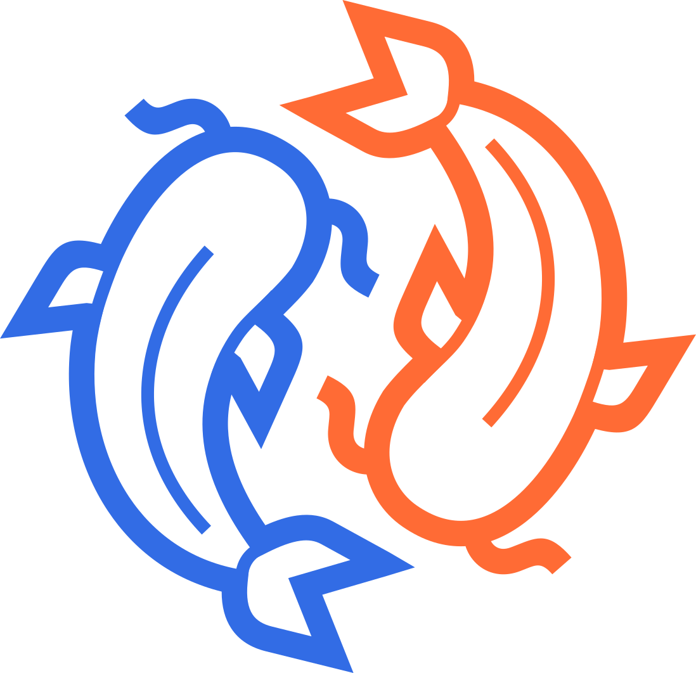

[//]: # (STANDARD README)
[//]: # (https://github.com/RichardLitt/standard-readme)
[//]: # (----------------------------------------------)
[//]: # (Uncomment optional sections as required)
[//]: # (----------------------------------------------)

[//]: # (Title)
[//]: # (Match repository name)
[//]: # (REQUIRED)

# karp

[//]: # (Banner)
[//]: # (OPTIONAL)
[//]: # (Must not have its own title)
[//]: # (Must link to local image in current repository)



[//]: # (Badges)
[//]: # (OPTIONAL)
[//]: # (Must not have its own title)

[![brainmade.org](https://img.shields.io/badge/brainmade.org-000000?style=flat&logo=data%3Aimage%2Fsvg%2Bxml%3Bbase64%2CPHN2ZyB4bWxucz0iaHR0cDovL3d3dy53My5vcmcvMjAwMC9zdmciIHdpZHRoPSIxZW0iIGhlaWdodD0iNzkiIHZpZXdCb3g9IjAgMCA2NyA3OSIgZmlsbD0ibm9uZSI%2BPHBhdGggZmlsbD0iI2ZmZiIgZD0iTTUyLjYxMiA3OC43ODJIMjMuMzNhMi41NTkgMi41NTkgMCAwIDEtMi41Ni0yLjU1OHYtNy42NzdoLTcuOTczYTIuNTYgMi41NiAwIDAgMS0yLjU2LTIuNTZWNTUuMzE1bC04LjgyLTQuMzk3YTIuNTU5IDIuNTU5IDAgMCAxLS45ODYtMy43MWw5LjgwNy0xNC43MTR2LTQuMzVDMTAuMjQgMTIuNTk5IDIyLjg0MyAwIDM4LjM4OCAwIDUzLjkzMiAwIDY2LjUzNCAxMi42IDY2LjUzOCAyOC4xNDNjLS42MzIgMjcuODI0LTEwLjc2IDIzLjUxNi0xMS4xOCAzNC4wNDVsLS4xODcgMTQuMDM1YTIuNTkgMi41OSAwIDAgMS0uNzUgMS44MSAyLjU1IDIuNTUgMCAwIDEtMS44MDkuNzVabS0yNi43MjMtNS4xMTdoMjQuMTY0bC4yODYtMTQuNTQyYy0uMjYzLTYuNjU2IDExLjcxNi04LjI0MyAxMS4wOC0zMC43MzQtLjM1OC0xMi43MTMtMTAuMzEzLTIzLjI3MS0yMy4wMzEtMjMuMjcxLTEyLjcxOCAwLTIzLjAyOSAxMC4zMDctMjMuMDMyIDIzLjAyNXY1LjExN2MwIC41MDYtLjE1IDEtLjQzIDEuNDJsLTguNjMgMTIuOTQxIDcuNjQ1IDMuODJhMi41NTkgMi41NTkgMCAwIDEgMS40MTUgMi4yOTF2OS42OTdoNy45NzRhMi41NTkgMi41NTkgMCAwIDEgMi41NiAyLjU1OXY3LjY3N1oiLz48cGF0aCBmaWxsPSIjZmZmIiBkPSJNNDAuMzcyIDU4LjIyMlYzOC45MzRjLjExOCAwIC4yMzcuMDE4LjM1NS4wMTggOS43NjktLjAxMiAxNy4wNS05LjAxMiAxNS4wMjItMTguNTY3YTIuMzY2IDIuMzY2IDAgMCAwLTEuODIxLTEuODIyYy04LjEwNi0xLjczLTE2LjEyMSAzLjI5Mi0xOC4wOTggMTEuMzQxLS4wMjQtLjAyNC0uMDQzLS4wNS0uMDY2LS4wNzNhMTUuMzIzIDE1LjMyMyAwIDAgMC0xNC4wNi00LjE3IDIuMzY1IDIuMzY1IDAgMCAwLTEuODIxIDEuODJjLTIuMDI4IDkuNTU1IDUuMjUyIDE4LjU1NCAxNS4wMiAxOC41NjguMjM2IDAgLjQ5Mi0uMDI4LjczOC0uMDR2MTIuMjEzaDQuNzMxWm0yLjgzOS0zMi4xNDNhMTAuNjQ2IDEwLjY0NiAwIDAgMSA4LjEyNC0zLjEwNmMuMzUgNi4zNC00Ljg4OCAxMS41NzctMTEuMjI4IDExLjIzYTEwLjU4IDEwLjU4IDAgMCAxIDMuMTA0LTguMTI0Wk0yNy40MDMgMzguMTkzYTEwLjYwNyAxMC42MDcgMCAwIDEtMy4xMTgtOC4xMjNjNi4zNDQtLjM1OCAxMS41ODcgNC44ODYgMTEuMjI4IDExLjIzLTMuMDIzLjE2OS01Ljk3My0uOTYxLTguMTEtMy4xMDdaIi8%2BPC9zdmc%2B)](https://brainmade.org/)

[//]: # (Short description)
[//]: # (REQUIRED)
[//]: # (An overview of the intentions of this repo)
[//]: # (Must not have its own title)
[//]: # (Must be less than 120 characters)
[//]: # (Must match GitHub's description)

Kubernetes-native presentation reconciliation, because apparently everything is Kubernetes now

[//]: # (Long Description)
[//]: # (OPTIONAL)
[//]: # (Must not have its own title)
[//]: # (A detailed description of the repo)

Karp is a kubernetes operator for your presentations. You define your presentation in a karp Kubernetes manifest, then
the karp operator manages all the kubernetes resources needed to ensure that your presentation is highly available.

## Table of Contents

[//]: # (REQUIRED)
[//]: # (Managed automatically)
[//]: # (Changes between the TABLE_OF_CONTENTS_START and TABLE_OF_CONTENTS_END markers will be overritten)

[//]: # (TOCGEN_TABLE_OF_CONTENTS_START)

- [Security](#security)
    - [Karp specifics](#karp-specifics)
    - [Standard Kubernetes hygiene](#standard-kubernetes-hygiene)
- [Background](#background)
    - [Goals](#goals)
    - [Non-goals](#non-goals)
- [Install](#install)
- [Usage](#usage)
    - [How it works](#how-it-works)
    - [Resources created](#resources-created)
    - [Example manifest](#example-manifest)
- [But... why?](#but-why)
- [AI Usage](#ai-usage)
- [Future features](#future-features)
    - [Theming](#theming)
    - [CloudFlare configuration](#cloudflare-configuration)
    - [Legacy Ingress support](#legacy-ingress-support)
- [Documentation](#documentation)
- [Repository Configuration](#repository-configuration)
- [API](#api)
- [Thanks](#thanks)
- [Contributing](#contributing)
- [License](#license)
    - [Code](#code)
    - [Non-code content](#non-code-content)

[//]: # (TOCGEN_TABLE_OF_CONTENTS_END)

## Security

> [!WARNING]
> karp is primarily a bit of fun, so you should probably avoid running it on a production cluster.

There are no known security concerns with this project, but nonetheless,
[PoLP](https://en.wikipedia.org/wiki/Principle_of_least_privilege) still applies. We strongly suggest taking all the
usual Kubernetes security precautions.

### Karp specifics

Karp requires RBAC permissions to create and manage `Deployment`, `Service`, `HTTPRoute`, `HorizontalPodAutoscaler`,
and `ConfigMap` resources. The full set of permissions is defined in the Helm chart in `charts/karp/templates/rbac.yaml`.
We encourage you to review these before installing.

The `image.url` field accepts arbitrary URLs. Karp will instruct your cluster to pull images from whatever URL is
provided, so only reference images from sources you trust.

Anyone with write access to `Presentation` resources can put arbitrary content onto a publicly accessible web page.
Ensure that RBAC on the `Presentation` CRD is appropriately restricted.

### Standard Kubernetes hygiene

- Install Karp in its own dedicated namespace.
- Consider applying a `NetworkPolicy` to presentation pods; a static HTML server has no reason to make outbound
  connections.
- Karp's Helm chart configures the nginx container to run as non-root. If you are deploying manually, ensure your
  Pod Security Standards enforce this.


## Background
[//]: # (OPTIONAL)
[//]: # (Explain the motivation and abstract dependencies for this repo)

The idea for this project came about through the desire to build upon the "Everything as Code" principle to reach
"Everything as Kubernetes". One can already define some interesting things with Kubernetes, beyond containerised
workloads, including but not limited to,
- Cloud infrastructure, using tools like [Crossplane](https://crossplane.io/)
- Policies, using tools like [Kyverno](https://kyverno.io/)
- CI pipelines, using tools like [Tekton](https://tekton.dev/)

[Marp](https://marp.app) is a great tool for defining presentations in markdown, but it stops short of getting your
presentation online. Assuming you already have a Kubernetes cluster lying around, Karp fills this gap, but goes one step
further by allowing you to define your presentation, and its requirements, entirely within a Kubernetes manifest.

The name comes from Kubernetes + Marp = Karp. Also, a carp is a type of fish, and anything aquatic fits the theme of
Kubernetes. The logo is of two yin yang carp, representing the continuous reconciliation loop of the operator, and the
balance between the desired state defined in the manifest and the actual state of the cluster.

The idea came from the request for a speech at a Kubernetes community group. This explored how the cybernetic
foundations of Kubernetes have allowed it to grow from a container orchestration tool to a platform for defining and
managing all sorts of resources, and so clearly that needed to be taken to its logical conclusion of defining that very
presentation in Kubernetes.

### Goals

To demonstrate that everything can be defined in Kubernetes, even something as seemingly trivial as a presentation.

### Non-goals

To be a good idea.


## Install

[//]: # (Explain how to install the thing.)
[//]: # (OPTIONAL IF documentation repo)
[//]: # (ELSE REQUIRED)

karp is installed via the helm chart in the `charts/karp` directory. To install karp, run the following command:

```bash
helm install karp charts/karp
```

## Usage
[//]: # (REQUIRED)
[//]: # (Explain what the thing does. Use screenshots and/or videos.)

### How it works
karp deploys your presentation by doing the following.
1. Read your karp manifest
2. Convert the manifest to Marp Markdown
3. Use the Marp CLI to convert the Markdown to HTML
4. Build the `nginx:alpine` container, with the HTML at `/usr/share/nginx/html`
5. Create a deployment within the cluster
6. Create a service to expose the deployment
7. Create a `HTTPRoute` to route traffic to the service, if `spec.gatewayRef` is specified
8. Ensure that if any of the above resources are deleted, they are recreated to maintain presentation desired state 

> [!TIP]
> For users familiar with Marp, writing a `Presentation` manifest might feel like translating your slides into YAML,
> only for Karp to immediately translate them back into Markdown in the background. This is by design.

### Resources created
karp creates and manages the following kubernetes resources.

| Resource                  | Description                                                                             | Conditions                          | User prerequisites                                                                                                       |
|---------------------------|-----------------------------------------------------------------------------------------|-------------------------------------|--------------------------------------------------------------------------------------------------------------------------|
| `Deployment`              | Manages pods running the nginx container serving the rendered presentation              | Always created                      | —                                                                                                                        |
| `Service`                 | Exposes the Deployment within the cluster                                               | Always created                      | —                                                                                                                        |
| `HTTPRoute`               | Routes external traffic from the Gateway to the Service                                 | Created if `spec.gatewayRef` is set | A Gateway must exist and be accessible. If the Gateway is in a different namespace, a `ReferenceGrant` must be in place. |
| `HorizontalPodAutoscaler` | Configures autoscaling to automatically adjust replica count when CPU usage reaches 70% | Always created                      | [Metrics Server](https://github.com/kubernetes-sigs/metrics-server) must be installed on the cluster                     |


> [!IMPORTANT]  
> karp assumes that your cluster is already accessible from the internet. Resources beyond kubernetes are your
> responsibility to manage.

### Example manifest

```yaml
apiVersion: karp.sh/v1
kind: Presentation
metadata:
  name: amazing-presentation
spec:
  minReplicas: 3
  maxReplicas: 10
  themeRef:
    kind: Theme
    name: AcmeCorpTheme
    namespace: default
  title: "My amazing presentation"
  gatewayRef:
    name: my-existing-gateway
    namespace: default
  hostname: amazing-presentation.example.com
  path: /my-presentation
  template:
    spec:
      slides:
      - title: "Welcome to my amazing presentation"
        subtitle: "Isn't this cool?"
        paragraph: "This presentation is running on Kubernetes, how amazing is that?"
        bulletList:
          - "Kubernetes is great for running presentations"
          - "Everything is Kubernetes now"
        orderedList:
          - "First, we define our presentation in a Kubernetes manifest"
          - "Then, the karp operator takes care of the rest"
        notes:
          - These are my speaker notes for this slide.
          - I can put anything I want here, and it won't be visible to the audience.
          - I can even put reminders to myself, like
          - "Don't forget to mention the Kubernetes cluster autoscaler when talking about how karp manages replicas!"
      - title: "Here's some code"
        code:
          language: "python"
          body: |
            def hello_world():
                print("Hello, world!")
      - title: "Time for a clever quote from a clever person"
        subtitle: "This is the subtitle for the quote slide"
        quote: Lorem ipsum dolor sit amet
        paragraph: "Isn't that a clever quote? No idea what it means, but it sounds clever."
        notes:
          - "Some people think Lorem ipsum is Latin, but it is actually just gibberish that looks like Latin."
      - title: "A picture says a thousand words!"
        subtitle: "Here's a picture of Rick Astley looking surprised"
        image:
          url: https://upload.wikimedia.org/wikipedia/en/f/f7/RickRoll.png
          alt: "Rick Astley looking surprised"
        paragraph: "Never gonna give you up, never gonna let you down, never gonna run around and desert you."
        links:
          - text: "Learn more about this image"
            url: https://en.wikipedia.org/wiki/Rickrolling

```


[//]: # (Extra sections)
[//]: # (OPTIONAL)
[//]: # (This should not be called "Extra Sections".)
[//]: # (This is a space for ≥0 sections to be included,)
[//]: # (each of which must have their own titles.)

## But... why?

This is, in fairness, [rather silly](https://www.youtube.com/watch?v=3ANufwUPFm8). A presentation probably does not need
high availability, let alone a Kubernetes cluster to run it. The main point of karp is that,
- it demonstrates that everything really can be defined in Kubernetes
- it was a fun project to build
- sometimes, it's ok to be silly

## AI Usage

[AGENTS.md](AGENTS.md) is generated by kubebuilder, the framework used to scaffold the operator.

This project is primarily [brain made](https://brainmade.org/); code was written by a human and AI was used as a
[rubber duck](https://en.wikipedia.org/wiki/Rubber_duck_debugging). No code was generated by AI. This is not because we
are against AI-generated code, but because,
- it is fun to write the code ourselves.
- knowing the code helps you debug it when things go wrong, and understand how to extend it with new features.

We have other projects that do use a more AI-assisted development process, so horses for courses.


## Future features

### Theming

Theming is not currently supported, so only the default theme is available. In future versions, we plan to add
`Theme` and `ClusterTheme` CRDs to allow users to define their own themes, and share them across presentations.

...and yes, you will define the themes entirely in Kubernetes manifests too, because of course you will.

Something like this:

```yaml
apiVersion: karp.sh/v1
kind: ClusterTheme
metadata:
  name: AcmeCorpTheme
spec:
  background: "#1a1a2e"
  foreground: "#326ce5"
  font:
    family: "JetBrains Mono"
    size: 32
  headings:
    color: "#ff6b35"
    weight: bold
  code:
    background: "#0d0d1a"
    color: "#9a8cce"
```

### CloudFlare configuration

If you are considering putting your presentation on its own domain name, purchase it through Cloudflare and then karp
will automatically configure Cloudflare to point the domain name to your presentation by creating Crossplane resources.

Will require Crossplane to be installed on the cluster, and a Cloudflare provider configured.

### Legacy Ingress support

karp only supports GatewayAPI. We may develop backward compatibility with ingress if there is demand for it, but we
encourage users to migrate to GatewayAPI if possible, as it is the future of Kubernetes networking.


## Documentation

Further documentation is in the [`docs`](docs/) directory.

## Repository Configuration

> [!WARNING]
> This repo is controlled by OpenTofu in the [estate-repos](https://github.com/evoteum/estate-repos) repository.
>
> Manual configuration changes will be overwritten the next time OpenTofu runs.


## API
[//]: # (OPTIONAL)
[//]: # (Describe exported functions and objects)

| Object                      | Description                                                                                               | Requirement                          | Default                        |
|-----------------------------|-----------------------------------------------------------------------------------------------------------|--------------------------------------|--------------------------------|
| `Presentation`              | CRD representing a presentation, including all slide content, routing, and deployment configuration       | Required                             | —                              |
| `spec.minReplicas`          | Minimum number of pods the HorizontalPodAutoscaler will maintain                                          | Optional                             | `3`                            |
| `spec.maxReplicas`          | Maximum number of pods that HorizontalPodAutoscaler is permitted to deploy                                | Optional                             | `10`                           |
| `spec.title`                | Top-level presentation title, used in metadata and status output                                          | Optional                             | `metadata.name`                |
| `spec.themeRef.kind`        | *Future release.* Whether to use a `Theme` (namespace-scoped) or `ClusterTheme` (cluster-scoped) resource | Optional                             | Built-in Marp default          |
| `spec.themeRef.name`        | *Future release.* Name of the theme resource, or a built-in Marp theme name                               | Optional                             | `default`                      |
| `spec.themeRef.namespace`   | *Future release.* Namespace of the `Theme` resource. Not applicable for `ClusterTheme`                    | Optional                             | Same namespace as Presentation |
| `spec.gatewayRef.name`      | Name of an existing Gateway to attach the HTTPRoute to                                                    | Optional                             | —                              |
| `spec.gatewayRef.namespace` | Namespace of the existing Gateway                                                                         | Optional                             | Same namespace as Presentation |
| `spec.hostname`             | Hostname at which the presentation will be served                                                         | Required if `spec.gatewayRef` is set | —                              |
| `spec.path`                 | URL path prefix for the presentation                                                                      | Optional                             | `/`                            |
| `spec.template.spec.slides` | Ordered list of slide definitions                                                                         | Required                             | —                              |
| `slides[].title`            | Slide title                                                                                               | Required                             | —                              |
| `slides[].subtitle`         | Slide subtitle                                                                                            | Optional                             | —                              |
| `slides[].paragraph`        | Body text                                                                                                 | Optional                             | —                              |
| `slides[].bulletList`       | Unordered list of points                                                                                  | Optional                             | —                              |
| `slides[].orderedList`      | Ordered list of points                                                                                    | Optional                             | —                              |
| `slides[].code.language`    | Programming language for syntax highlighting                                                              | Optional                             | Plain text                     |
| `slides[].code.body`        | Code content                                                                                              | Required if `slides[].code` is set   | —                              |
| `slides[].quote`            | Pull quote text                                                                                           | Optional                             | —                              |
| `slides[].image.url`        | URL of an image to display                                                                                | Required if `slides[].image` is set  | —                              |
| `slides[].image.alt`        | Alt text for the image                                                                                    | Optional                             | —                              |
| `slides[].links`            | List of reference links, each with `text` and `url`                                                       | Optional                             | —                              |
| `slides[].notes`            | Speaker notes, not visible to the audience                                                                | Optional                             | —                              |

> [!NOTE]  
> If `spec.gatewayRef` is not set, no HTTPRoute will be created and the presentation will only be accessible within the cluster.


[//]: # (## Maintainers)
[//]: # (OPTIONAL)
[//]: # (List maintainers for this repository)
[//]: # (along with one way of contacting them - GitHub link or email.)


## Thanks
[//]: # (OPTIONAL)
[//]: # (State anyone or anything that significantly)
[//]: # (helped with the development of this project)

Big thanks to [Vectorportal.com](https://www.vectorportal.com) for sharing the
"[Yin Yang Fish](https://vectorportal.com/vector/yin-yang-fish/36470)" image under the
[CC BY](https://creativecommons.org/licenses/by/4.0) license. Changes we made were,
- converted the provided .eps to .svg using Inkscape, then made manual adjustments to the SVG file to remove bloat.
- changed the left fish colour from #9a8cce (light purple) to #326ce5
  ([Kubernetes blue](https://github.com/kubernetes/kubernetes/blob/master/logo/logo.svg)) 
- changed the right fish colour from #9a8cce (light purple) to #ff6b35 (orange).

## Contributing
[//]: # (REQUIRED)
If you need any help, please log an issue and one of our team will get back to you.

PRs are welcome.


## License
[//]: # (REQUIRED)

### Code

All source code in this repository is licenced under the [GNU Affero General Public License v3.0 (AGPL-3.0)](https://www.gnu.org/licenses/agpl-3.0.en.html). A
copy of this is provided in the [LICENSE](LICENSE).

### Non-code content

All non-code content in this repository, including but not limited to images, diagrams or prose documentation, is
licenced under the
[Creative Commons Attribution-ShareAlike 4.0 International](https://creativecommons.org/licenses/by-sa/4.0/) licence, unless otherwise stated in the file header.
